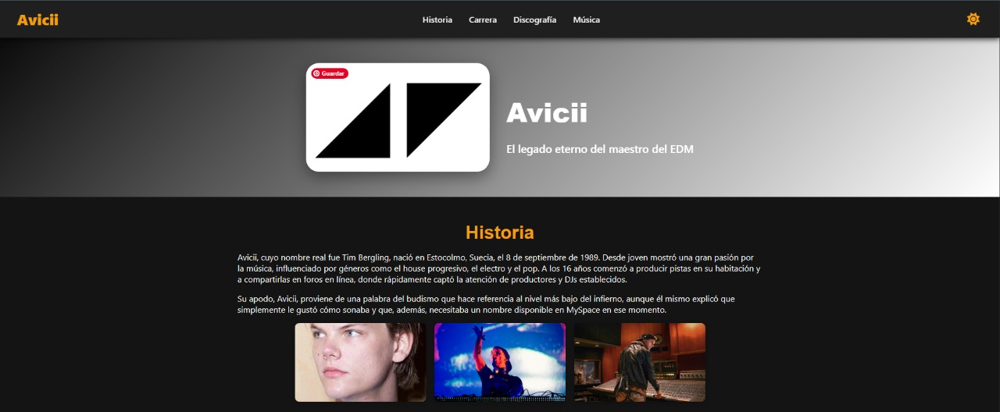

# 🎶 Avicii Tribute - Página Web

👉 **[Ver proyecto en línea aquí](https://fabianoriundo.github.io/Proyecto-Html-CSS-/)**

Este proyecto es una página web homenaje al legendario DJ y productor sueco **Avicii**, creada con **HTML**, **CSS (personalizado + modo claro/oscuro)**, **JavaScript** y contenido multimedia (audio, imágenes y video).

---

## 🌐 Vista previa



---

## 🚀 Funcionalidades

- 🎨 **Tema claro/oscuro** con guardado de preferencia en `localStorage`  
- 📀 **Sección de discografía** en carrusel horizontal interactivo  
- 🎧 **Reproductor de música** con 3 canciones representativas  
- 🖼️ **Galería de imágenes** con visualización ampliada en modal  
- ℹ️ **Modal de información** de álbumes al hacer clic sobre cada carátula  
- 📱 **Diseño responsive** adaptado a móviles, tablets y escritorio  

---

## 🛠 Tecnologías usadas

- HTML5  
- CSS3 (estilos personalizados + media queries)  
- JavaScript (DOM, eventos, almacenamiento local)  
- Font Awesome (íconos sociales y funcionales)  

---

## 📁 Estructura de carpetas

```sh
/audio
├── wake-me-up.mp3
├── sos.mp3
├── waiting-for-love.mp3
/css
├── estilos.css
/js
├── script.js
/img
├── true.png
├── stories.png
├── tim.jpg
├── avicci01.jpg
├── vivo.jpg
├── premios.jpg
├── logo.png
├── joven.webp
├── giras.jpg
├── estudio.jpg
├── colab.jpg
├── cap.jpg
index.html
README.md
```

---

## 📌 Cómo usar el proyecto

1. Clona el repositorio:
   ```bash
   git clone https://github.com/fabianoriundo/Proyecto-Html-CSS-.git
   ```
2. Abre el archivo `index.html` en tu navegador.

---

## 💡 Ideas de mejora futura

- Añadir un reproductor más avanzado con playlist  
- Conectar a una API de Spotify o YouTube para música en línea  
- Agregar una sección de comentarios con almacenamiento local o backend  
- Traducir la página a inglés (modo multilingüe)  
- Mejorar accesibilidad (uso de `aria-label`, navegación con teclado)

---

## ❤️ Agradecimientos

- A la comunidad de fans de Avicii por mantener su legado vivo  
- A los recursos gratuitos de iconos y música para uso educativo  
- A [Tu nombre o seudónimo] por el diseño y desarrollo web

---

## 📄 Licencia

Este proyecto fue desarrollado con fines educativos y no comerciales. Todos los recursos audiovisuales pertenecen a sus respectivos autores.
